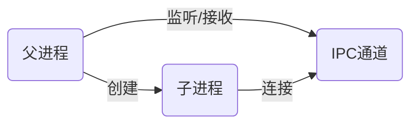

# 进程

`process` 提供有关当前 Node.js 进程的信息并对其进行控制

## 信息

- `argv`：返回启动 Node.js 进程时传入的命令行参数组成的数组
- `channel`：如果该进程是被创建的子进程，则该属性是对 IPC 通道的引用
- `env`：返回包含用户环境的对象
- `pid`：返回当前进程的进程 id
- `ppid`：返回父进程的 id

## 事件

- `message`：收到父进程通过 IPC 发送的消息时触发
- `unhandledRejection`：`Promise` 被拒绝并且在事件循环的一个轮询内没有添加错误句柄处理时触发
- `rejectionHandled`：每当 `Promise` 被拒绝并且错误句柄被附加时晚于一轮事件循环时触发
- `exit`：进程退出时触发，进程退出时机：
	-  `process.exit()` 方法被显式调用
	- 事件循环不再需要执行任何额外的工作

## 方法

- `exit`：指示 Node.js 以指定的退出状态同步终止进程，默认为 0 （成功）
- `cwd`：返回 Node.js 进程的当前工作目录
- `kill`：杀死指定 id 的进程，实际上只是一个信号发送者，就像 `kill` 系统调用一样

# 子进程

通过 `child_process` 模块可以创建子进程，并可以通过 IPC 与子进程进行通信。

## 创建

异步创建方式：

- `exec`：创建一个子进程（shell）执行命令，通过回调（子进程退出时调用）可以获取 shell 的输出
- `spawn`：创建一个子进程（shell）执行命令，但是没有回调去获取输出
- `execFile`：创建一个子进程执行可执行文件，如果是 js 文件则文件开头必须有 `#!/user/bin/env node` 
- `fork`：创建一个子进程执行 js 文件

```javascript
// exec
const child = exec('node -v',  (err, stdout, stderr) => console.log(stdout));

// spawn
const child = spawn('node', ['-v']);
child.on('spawn', () => child.stdout.pipe(process.stdout));

// execFile
const child = execFile('./worker.js');

// fork
const child = fork('./worker.js');
```

## 通信

实现进程间通信的方式有很多，比如：管道、socket、信号量、共享内存、消息队列、Domain Socket等。

Node 实现 IPC 采用的管道（抽象层面的称呼），具体的细节由 libuv 实现：在 windows 下采用命名管道实现，而*nix系统则采用 Unix Domain Socket 实现。

对于上层的暴露的接口十分简单，通信方式只有 `send` 方法和 `message` 事件。

```javascript
const worker = fork(join(__dirname, './worker.js'));
// 子进程创建成功触发此事件
worker.on('spawn', () =>  worker.send('hello'));

// worker.js

console.log('子进程启动成功, processID:', process.pid);

process.on('message', msg =>  console.log('子进程收到消息:', msg));
```

具体的过程：

1. 父进程在实际创建子进程之前，会先创建IPC通道并监听它，然后再真正的创建子进程。
2. 通过环境变量 `NODE_CHANNEL_FD` 告知子进程 IPC 通道的文件描述符
3. 子进程在启动过程中，根据文件描述符去连接该 IPC 通道



异步创建的子进程会返回一个 `ChildProcess` 的实例，表示创建的子进程，通过该实例可以向 IPC 通道传递信息。

**事件：**

- `spawn`：子进程创建成功触发
- `message`：收到子进程的消息触发
- `exit`：子进程退出触发

**方法：**

- `send`：向子进程发送消息，会触发子进程的 `message` 事件
- `kill`：kill 该子进程，接着触发 `exit` 事件

## 句柄传递

`send` 方法除了可以发送一般的数据，还可以传递句柄（文件描述符）目前只支持传递 TCP 和 UDP 套接字。

利用 `send` 发送套接字即可实现多个子进程监听同一个端口：

```javascript
// master.js
const server = createServer(socket => socket.end('父进程处理请求'));

const workers = new Map();

for (let i = 0; i < cpus().length; i++) {
    const worker = fork('./worker.js');
    workers.set(worker.pid, worker);
}

server.listen(8080, () => workers.forEach(w => w.send('server', server)));

// worker.js
process.on('message', (msg, server) => {
    if (msg === 'server') {
        server.on('connection', socket => socket.end(`子进程 ${process.pid} 处理请求`));
    }
});
```

当多个进程监听同一个端口，一个连接只能被一个进程所处理，目前仅在 Unix 平台上支持。

**句柄的发送和还原**

发送到 IPC 管道中的文件描述符（句柄），实际上就是一个整数值。

而发送的消息先会被封装成一个对象，接着会被 `JSON.stringify` 序列化：

```json
{
    cmd: "NODE_HANDLE",
    type: "net.Server",
    msg: message
}
```

当子进程接收到父进程发来的消息，会先通过 `JSON.parse` 解析消息，然后触发 `message` 事件将消息传递上去。


在这个过程中，如果消息对象的 `message.cmd` 以 `NODE_` 为前缀则会响应一个内部事件 `internalMessage`。

如果 `message.cmd` 的值为 `NODE_HANDLE`，则会依据 `message.type` 的值和文件描述符一起还原出一个对象。

具体的就是如果 `message.type` 值为 `net.Socket` 则会创建一个 TCP 服务器对象，并让该对象监听文件描述符。

我们在 `message` 事件处理程序中得到的 `handle` 就是这个新创建的 `net.Server` 对象。

```javascript
// 伪代码
const server = new net.Server();
server.listen(fd);
```

而多个应用监听相同的端口时，文件描述符同一时间只能被一个进程所使用，所以当来请求时只有一个进程能够幸运的抢到连接。

# 集群

`cluster` 模块可以创建共享服务器端口的子进程，使用 `child_process` 构建集群比较麻烦需要解决许多问题。

```javascript
const cluster = require('cluster');
const http = require('http');
const count = require('os').cpus().length;

if (cluster.isMaster) {
    // 衍生工作进程。
    for (let i = 0; i < count; i++) {
        cluster.fork();
    }
} else {
    console.log(`工作进程 ${process.pid} 已启动`);
    // 工作进程可以共享任何 TCP 连接。
    // 在本例子中，共享的是 HTTP 服务器。
    http.createServer((_, res) => res.end(`工作进程 ${process.pid} 处理请求`)).listen(8000);
}
```

## 工作原理

`cluster` 模块就是 `child_process` 和 `net` 的组合应用。

当 `culster` 启动时会在内部启动 TCP 服务器，父进程会将 TCP 的 socket 发送给子进程。

通过 `culster.fork` 出来的子进程存在环境变量 `NODE_UNIQUE_ID`，只要子进程中使用了 `listen` 就会通过文件描述符重用端口。

[cluster 实现原理](https://cnodejs.org/topic/56e84480833b7c8a0492e20c)

## 功能

事件：

- `message`：当集群主进程从任何工作进程接收到消息时触发
- `online`：当衍生一个新的工作进程后，工作进程应当响应一个上线消息

- `exit`：当任何一个工作进程关闭的时候，cluster 模块都将会触发 `'exit'` 事件

方法：

- `setupMaster`：用于修改默认的 'fork' 行为，只能主进程调用
- `fork`：衍生出一个新的工作进程，只能主进程调用

可以通过 `setupMaster` 方法将主进程和子进程在代码上分开。

```javascript
const { setupMaster, fork } = require('cluster');
const cpus = require('os').cpus().length;
setupMaster({
    exec: 'worker.js'
});
for (let i = 0; i < cpus; i++) {
    fork();
}
```


