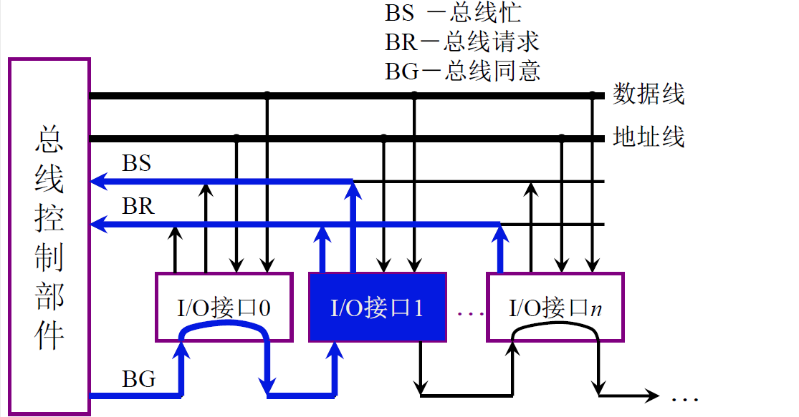
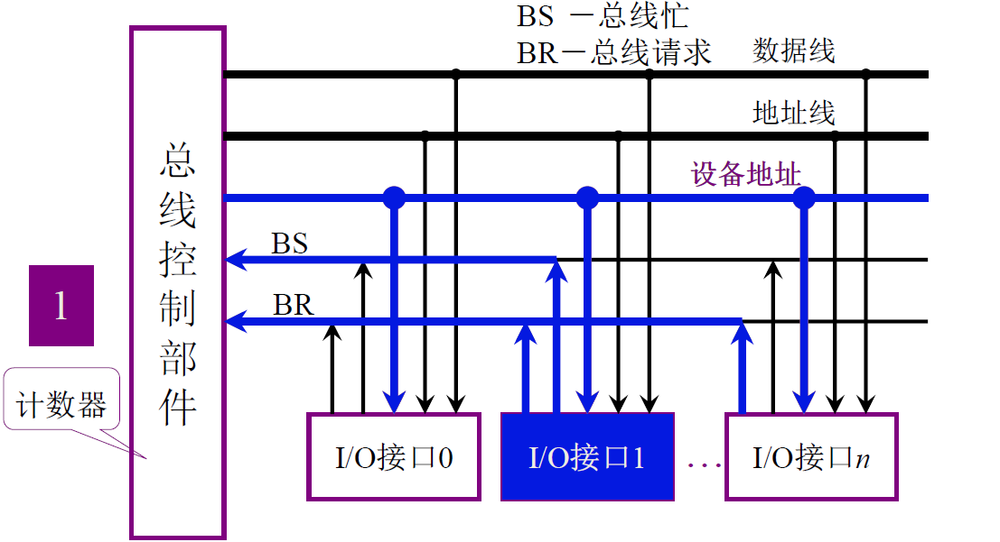
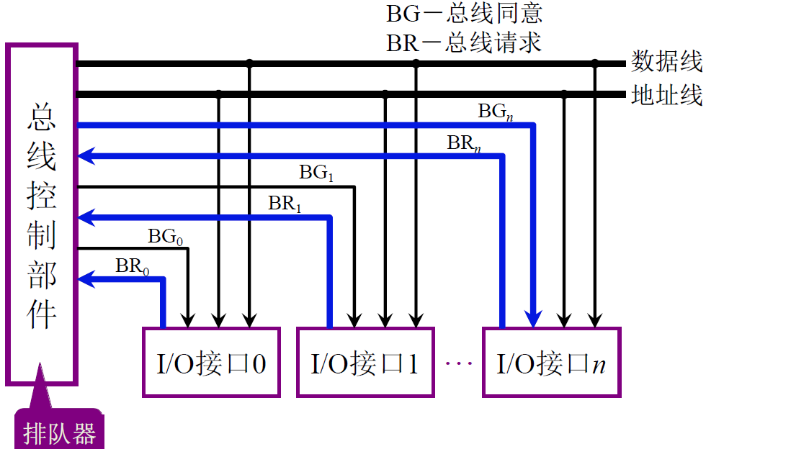

# 什么是总线（bus）

总线是连接各个部件的信息传输线，是 **各个部件共享的传输介质**

总线上信息的传送方式：串行、并行

# 总线的分类

1. 片内总线

	**芯片内部** 的总线

2. 系统总线

	**计算机各部件之间** 的信息传输线

	- 数据总线（双向）
	- 地址总线（单向）
	- 控制总线（有出 有入）

3. 通信总线

	用于 **计算机系统之间** 或 **计算机系统与其他系统**（如控制仪表、移动通信等）之间的通信

# 总线的性能指标

1. 总线宽度
2. 标准传输率
3. 时钟同步/异步
4. 总线复用
5. 信号线数
6. 总线控制方式
7. 其他指标

# 总线结构

1. 单总线
2. 双总线
3. 三总线
4. 四总线

# 总线控制

## 总线判优（仲裁）

主设备：对总线有 控制权

从设备：响应从主设备发来的总线命令

总线判优控制的方式：

1. 集中式
	- 链式查询
	- 计数器定时查询
	- 独立请求方式
2. 分布式

### 链式查询

### 计数器定时查询

### 独立请求

## 总线通信

目的：解决通信双方 **协调配合** 的问题

总线传输周期：

1. 申请分配阶段     **主模块申**请，总线仲裁决定
2. 寻址阶段             主模块向从模块 **给出地址** 和 **命令**
3. 传数阶段             主模块和从模块 **交换数据**
4. 结束阶段             主模块 **撤消有关信息**

总线通信的方式：

- 同步             由 **统一时标** 控制数据传送
- 异步             采用 **应答方式** ，没有公共时钟标准
- 半同步          同步、异步结合
- 分离式          充分挖掘系统 **总线每个瞬间** 的潜力
